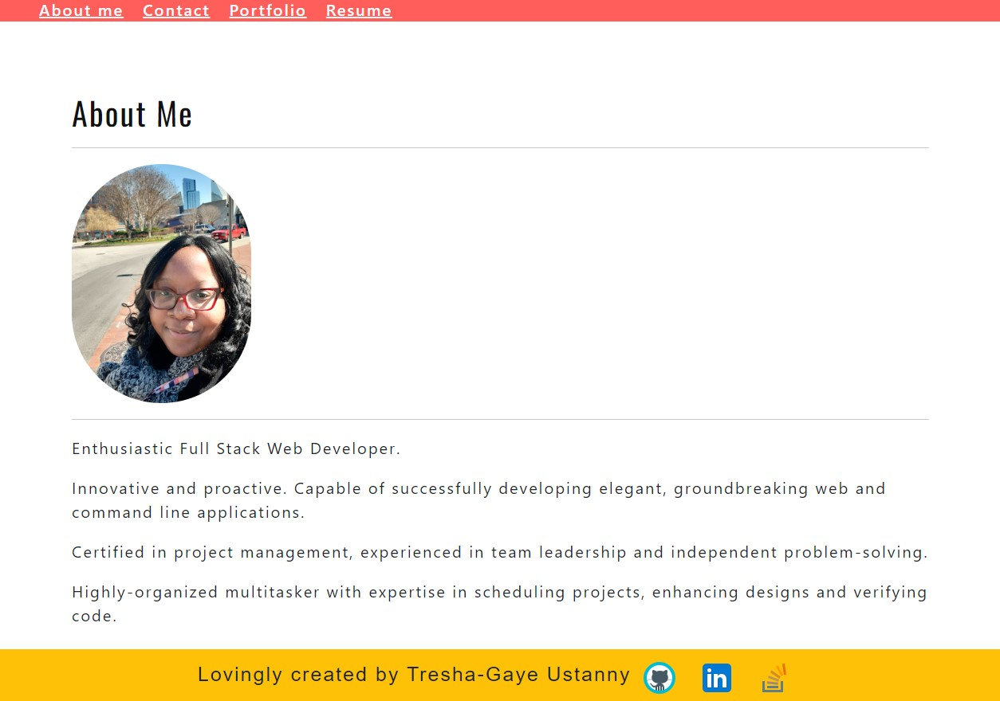
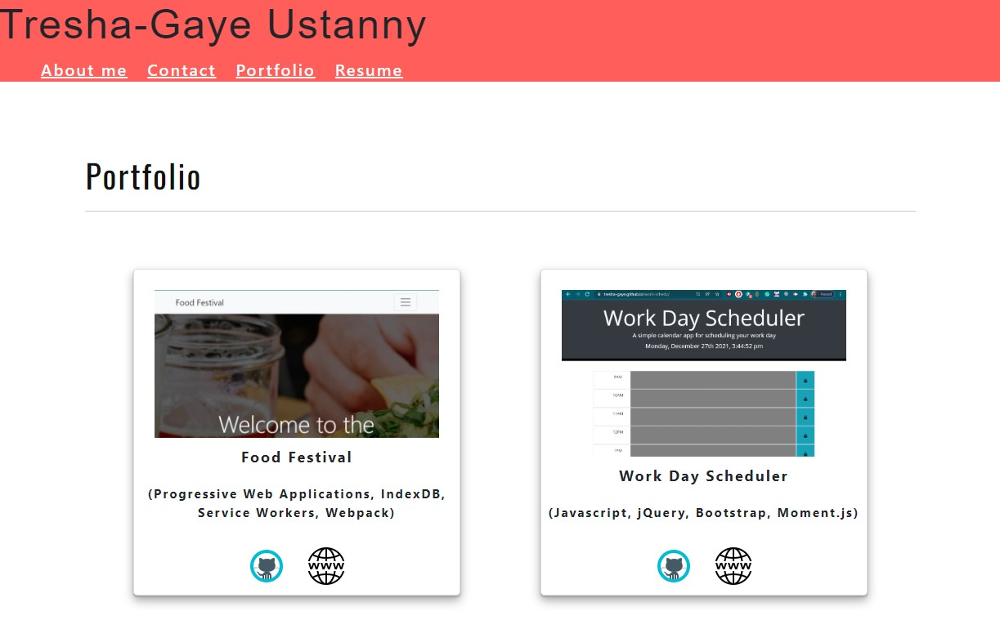

# Personal React Portfolio

## Description

This application is my personal portfolio and showcases several projects that I recently completed using the latest technologies.

You may view the deployed application by [clicking this link](https://tresha-gaye.github.io/TGU-react-portfolio/).

## Technologies

- The application uses React to render content and is deployed to Github Pages.
- This application was bootstrapped with [Create React App](https://github.com/facebook/create-react-app).

**Below are a screenshots of the app:**

  
 
  
 

## Contributing

## Credits

**The following resources were used to complete this project:**
1. UCONN Coding Bootcamp's modules on REACT
2. [Create React App documentation](https://facebook.github.io/create-react-app/docs/getting-started)

## License

## Contact

Email Tresha-Gaye Ustanny with any questions at [treshagaye@gmail.com](mailto:treshagay@gmail.com) or visit my [GitHub Homepage](https://github.com/Tresha-Gaye).